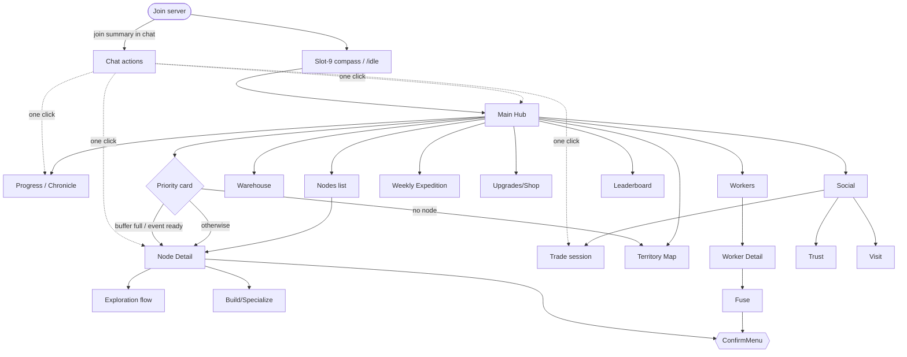

# Idle Comprehensive UI Flow and Chat Click Actions

Companion to `UX_FLOWS.md` (screen contents) and `GUI_COMMAND_REFACTOR.md`
(information architecture). This document is the master map of *how players
move between surfaces*, and the complete specification for clickable chat
actions (`CommandLinks.run` / `CommandLinks.suggest`).

## 1. Surface model

| Surface | Role | Used for |
|---|---|---|
| Inventory GUI (Java) | Primary | Browsing, comparing, deciding, confirming |
| Bedrock Forms | Primary (Floodgate) | Same actions as GUI, generated from the same menu actions |
| Chat click actions | Moment-driven | "Something happened → one click to the next step" while no menu is open |
| Action bar | Ambient | Passive status ticks (payout), never actionable |
| ChatPrompt / CustomForm | Input | Exact values only (names, amounts, IDs, reasons) |

Routing rules:

1. The GUI/Forms path is the canonical way to do everything. Chat actions
   are shortcuts, never the only path (`UX_FLOWS.md` §0).
2. A chat action fires **at the moment an event happens** and carries the
   single most useful next step. It never replaces browsing.
3. The action bar never carries decisions. If a state needs a decision, it
   gets one chat line with a click action, or a Hub priority card.
4. Both renderers reach the same service; a chat click routes through the
   same permission-checked command handlers.

## 2. Master flow graph (player)



The two-click rule from `UX_FLOWS.md` still governs the GUI graph. Chat
actions exist to make it a **one-click** rule for event-driven moments.

## 3. Chat action design system

### 3.1 Message anatomy

```
[Idle] <what happened + consequence> [Primary] [Secondary]
```

- Copy is Thai-first (`UX_FLOWS.md` §17), one line, no lore prose.
- At most **two** click actions per line: one primary verb, one optional
  navigation fallback (`[เปิดเมนู]`).
- Labels are square-bracketed verbs, yellow underlined (already the
  `CommandLinks` style). The hover text shows the exact command.
- The message must still make sense if the player never clicks: state the
  fact, then offer the shortcut.

### 3.2 Action tiers — when `run`, when `suggest`, when GUI-only

| Tier | Meaning | Chat treatment | Examples |
|---|---|---|---|
| S — safe shortcut | Idempotent, no cost, no args | `CommandLinks.run` | open Hub/Progress/Warehouse, claim ready loot, accept trade *request* |
| A — needs input | Command requires an argument | `CommandLinks.suggest` with trailing space | `/idle trust `, `/idle visit `, admin commands with args |
| B — spends or commits | Costs resources but reversible-ish | `run` may only **open the GUI screen** where the cost preview lives | start exploration with preparation, shop purchases |
| C — destructive / premium | Irreversible or spends Credits | Never actionable from chat, not even as a link to a confirm screen shown out of context | unclaim, convert, fuse confirm, Credits spend, force-unclaim |

Rationale for Tier C: a chat line has no before/after balance preview, and
stale lines can be clicked days later. Every destructive path keeps its
double-confirm inside a menu the player deliberately opened.

### 3.3 The context-free rule (hard requirement)

**Every command attached to `CommandLinks.run` must succeed from any
location and any menu state.** Chat lines outlive the moment: the player
may click from spawn, from another node, or after relog.

Implemented: `/idle collect [nodeId]` and `/idle explore <action> [nodeId]`
resolve explicit id → standing chunk → Focused Node (`resolveNode` in
`IdleCommand`), and every exploration chat link embeds the node id. NPC
refreshes use the node's own world, so clicks work cross-world.

Fix pattern for future position-dependent commands, in order of preference:

1. Add an optional explicit target: `/idle explore claim [nodeId]`,
   `/idle collect [nodeId]`. Chat links always embed the id.
2. Fall back to the Focused Node when no id is given and the player is not
   standing on a node.
3. If neither applies, the link opens the relevant GUI screen instead of
   running the verb.

### 3.4 Staleness and idempotency

Clicking an old link must never corrupt state or double-pay:

- The handler re-validates state (the service layer already does) and, on a
  stale click, replies with the *current* state plus the correct next
  action link — not a bare error. Example: clicking `[Claim]` after
  claiming replies `“เก็บรางวัลไปแล้ว — อีเวนต์ถัดไปในอีก 3 ชม.”`.
- Reward-claiming commands stay idempotent server-side (claim-once
  semantics already enforced by the services).

### 3.4b Token-bound confirmations (Tier B exception)

A spending verb may be attached to `CommandLinks.run` when, and only when, the
link carries a **single-use session token** issued moments earlier.

The only current instance is placement preview: `/idle claim confirm <token>`.

This does not weaken the Tier B and Tier C rules, because both of the reasons
those rules exist are already answered:

- *"A chat line has no before/after preview."* The preview **is** the cost
  preview, and a stronger one than a GUI screen: the player is standing in
  front of a ghost of the building, with cost, ground level, and obstruction
  count on screen.
- *"Stale lines can be clicked days later."* The token is single-use and its
  session expires (default 60s). A stale click matches no live session, so it
  charges nothing and replies with the current state plus the correct next
  action, exactly as §3.4 requires.

Requirements for any future token-bound confirm:

1. The token is generated per session, never derived from the player or target.
2. Confirming consumes the session; a second click cannot re-fire it.
3. The session expires on its own, and on quit or world change.
4. The handler **re-runs full validation** at confirm time. The token proves
   the player saw the offer; it never proves the offer is still valid.
5. Cancelling is always offered alongside, and costs nothing.

Verbs that are irreversible or spend Credits stay Tier C regardless of tokens.

### 3.5 Notification budget

Chat is a scarce surface; `UX_FLOWS.md` §10 already bans achievement spam.

- One actionable line per event **transition**, not per tick. Buffer-full
  notifies once when the node flips to `STORAGE_FULL`, then goes quiet.
- Per-category cooldown (default 10 min) for re-notification while the
  condition persists; persistent conditions escalate to the Hub priority
  card instead of repeating in chat.
- Everything that happened while offline is batched into **one** join
  summary block (§4.2), max ~6 lines, each with its own action.
- Settings page exposes notification frequency (`UX_FLOWS.md` §17).

### 3.6 Bedrock notes

- Geyser/Floodgate passes chat click events through, so `run` links work
  for Bedrock players; keep lines short because Bedrock chat wraps hard.
- Chat actions are still only shortcuts: every action remains reachable in
  the Forms flow, which stays the primary Bedrock surface.
- `suggest` links degrade poorly on Bedrock (no chat-input prefill in some
  clients). Tier-A lines therefore always include a GUI fallback link.

## 4. System-by-system catalog

Legend: ✅ already implemented, 🔶 partial, ❌ missing.

### 4.1 Help and discovery — ✅

`/idle help`, `/idle admin help`: category links (`run`), complete commands
(`run`), argument commands (`suggest`). `[เปิด Hub]` / `[เปิด Admin Hub]`
headers. This is the reference implementation of the pattern.

### 4.2 Join summary (streak + offline recap) — ✅ (commission line pending)

On login, after `StreakService.handleLogin`, send one block:

```
[Idle] กลับมาแล้ว! ระหว่างออฟไลน์:
  ผลผลิต 3 Node เต็ม buffer          [เก็บทั้งหมด] [ดู Node]
  Exploration สำเร็จ 1 รายการ          [รับรางวัล]
  Commission ใกล้ครบ 1 งาน            [เปิด Progress]
  Login streak 6 วัน +900 Coins        (จ่ายแล้วอัตโนมัติ)
```

- `[เก็บทั้งหมด]` runs the Quick-Collect-All service path only if the perk
  is owned; otherwise the line links `[ดู Node]` → `/idle nodes`.
- Sourced from the same state the Hub priority card reads; the summary and
  the card can never disagree.

### 4.3 Production buffer — ✅

- Transition to `STORAGE_FULL`: one line,
  `“Node <type> เต็มแล้ว — การผลิตหยุด”` + `[เก็บผลผลิต]`
  (`/idle collect <nodeId>`, Tier S after §3.3 fix) + `[เปิด Node]`.
- Payout ticks stay on the action bar, never in chat.

### 4.4 Exploration — 🔶

- Event spawned: ✅ `[Open]` link with embedded node id.
- Completed: ✅ `[Claim]` with embedded node id (context-free per §3.3).
- Start from chat stays Tier B: `[Start]` should open the Node/Exploration
  screen (crew, odds, preparation preview), not fire the start verb
  blindly. Change the current `[Start]` run-link in `IdleCommand.java:859`
  to open the GUI once a deep-open command exists (§6).

### 4.5 Warehouse — ❌

- On failed claim because storage is full, the error itself carries the
  fix (see §5): `[เปิด Warehouse]` (`/idle warehouse`, Tier S).
- No proactive "warehouse almost full" chat spam; that is a Hub card.

### 4.6 Trade (escrow) — 🔶

- Request received: ✅ `[Accept]` `[Decline]` (`/idle trade decline`).
- Session updates (offer changed, other side confirmed): ✅ append
  `[View]` (`/idle trade view`) — final `confirm` stays inside the trade
  GUI (Tier C: it commits escrow).
- Escrow settlement/refund notices are informational, plus `[เปิด Warehouse]`
  when items were delivered there.

### 4.7 Commissions / Projects / Expedition / Chapter — ✅

- Commission completed (auto-settle done): one line with `[เปิด Progress]`
  (`/idle progress`, alias `commissions`, Tier S).
- Item-reward commissions (safe claim): `[รับรางวัล]` deep-opens Progress.
- Project stage completed (global): server-wide single line, `[ดู Project]`
  (`/idle projects` alias, Tier S). Contribution submit stays GUI (Tier B).
- Weekly Expedition open/closing-soon: `[เปิด Expedition]`
  (`/idle expedition`, Tier S). Two lines per week maximum.
- Starter Chapter step ready: `[รับรางวัล]` (`/idle chapter`, Tier S —
  idempotent claim).

### 4.8 Social: trust and visits — ✅ (granted/revoked lines with [Visit])

- Trust granted to you: `“<owner> ให้สิทธิ์ Helper ในพื้นที่ของเขา”` +
  `[ไปเยี่ยม]` (`/idle visit <owner>`, Tier S: teleport is reversible) +
  role capability delta per `UX_FLOWS.md` §14.
- Trust revoked: informational only.
- Suggest-style helper in Social screens: `[/idle trust <ชื่อ>]` as a
  `suggest` link (Tier A) — already the pattern in help.

### 4.9 Workers — ✅ (safety lines carry [Open Bag])

- Safety ejection (`WorkerSafetyListener`): the existing warning gains
  `[เปิดกระเป๋า Worker]` (`/idle bag`, Tier S).
- Fuse results, hire, assign: GUI-only by design (Tier B/C).

### 4.10 Shop, Credits, economy — GUI-only by policy

No chat action ever spends Coins or Credits (Tier C). Receipts after a
purchase are informational; `[ประวัติการซื้อ]` may link `/idle credits`
(read-only, Tier S).

### 4.11 Admin — 🔶

- Admin help: ✅ links exist (`AdminCommands.java:130-160`).
- Alerts: ✅ validation failure after reload → content scope, `[Validate]`;
  duplicate worker-token attempt in trade → audit scope, `[View Audit]`
  with the player pre-filtered (`AdminAlerts.broadcast`). Economy outlier
  alerts wait on actual outlier detection in `TelemetryService`.
- Mutations keep the GUI/typed path: reason capture and double-confirm do
  not fit chat. `forceunclaim` and friends are never chat-linked (Tier C).

## 5. Errors carry their own fix

Extends `UX_FLOWS.md` §15: the corrective action in an error message is a
click action whenever one exists.

```
ต้องใช้ 1,800 Coins (มี 1,420) — ทำ Commission วันนี้ได้อีก 600   [เปิด Progress]
Loot ปลอดภัย — ที่ว่างใน Warehouse ไม่พอ 37 ช่อง                  [เปิด Warehouse]
ต้องยืนบน Node ของคุณ — หรือระบุหมายเลข Node                        [ดู Node ของฉัน]
```

Rule: an error line without at least a navigation link is a copy bug.

## 6. Command surface changes required

| Change | Reason | Tier impact |
|---|---|---|
| `/idle collect [nodeId]` — ✅ done | context-free `[เก็บผลผลิต]` links (§3.3) | enables Tier S |
| `/idle explore <action> [nodeId]` (+ Focused-Node fallback) — ✅ done | fix existing stale-link failure | fixed |
| `/idle explore info [nodeId]` deep-open of Exploration screen | `[Start]` becomes open-screen (Tier B) | safer start flow |
| `/idle trade decline` (or make `cancel` pre-session-safe) | `[ปฏิเสธ]` on request line | enables Tier S |
| Optional: `/idle open <screen>` internal deep-link verb | one canonical way for chat → specific GUI screen | simplifies §4 |

All additions are argument extensions to existing `CommandCatalog` entries;
tab completion and help inherit them automatically.

## 7. Implementation checklist (priority order)

1. **P0 — correctness** ✅ done: node-id argument + Focused fallback for
   every `explore` action and `collect`; exploration chat links embed the
   node id.
2. **P0 — plumbing**: small `ChatActions` helper (wraps `CommandLinks`,
   adds the `[Idle]` prefix, two-action limit, per-category cooldown
   registry persisted per player session).
3. **P1 — join summary** (§4.2) ✅, buffer-full transition line (§4.3) ✅.
4. **P1 — trade session actions** (§4.6) ✅: decline + view links.
5. **P2 — progress moments** (§4.7) ✅: commission/project/expedition/chapter
   via injectable notifiers so the design services stay headless-testable.
6. **P2 — social + worker safety lines** (§4.8, §4.9) ✅.
7. **P3 — admin alerts** (§4.11) ✅ (reload validation + duplication;
   outlier alerts blocked on detection).
8. **P3 — error-copy sweep** (§5) ✅ for the high-traffic command errors
   (no-target-node, warehouse-full collect, manage-trust, unknown type,
   fuse-contract); GUI-internal errors already sit next to their fix.

Each step reuses existing services; no new game logic. Tests follow the
`CommandLinksTest` pattern: assert the component's click event action and
command string per tier.
